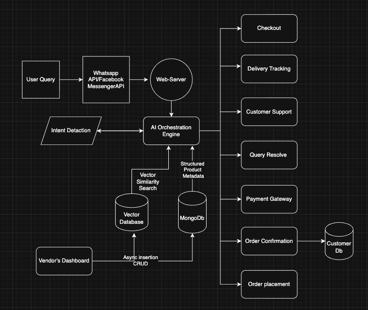

# ChatKart AI

ChatKart AI is an AI-powered conversational commerce assistant targeting vendor–customer interactions.  
It integrates **Rasa** for structured dialogue, **Ollama LLM** for reasoning and inference, and **MongoDB** for dynamic vendor-specific product data.  
The bot can operate on messaging channels like **WhatsApp Business** or **Facebook Messenger**.

---

## 🏗 System Architecture

<p align="center">
  
</p>
ChatKart follows a layered architecture:

- Messaging layer for multi-channel user queries  
- AI orchestration layer with RAG-based retrieval  
- Commerce services with payment gateway + webhook confirmation  
- Structured & vector databases for hybrid retrieval  
---

## 📦 Components

### 1. **Rasa NLU & Core**
- Handles **intent classification** and **entity extraction**.
- Manages structured **dialogue flows** for predictable conversation.
- Runs as a **Docker container** (`rasa` and `rasa-actions`).

### 2. **MongoDB**
- Stores:
  - Vendor product inventories
  - Customer details
  - Knowledge for retrieval
- Each vendor’s dataset is isolated, allowing the bot to serve **vendor-specific responses**.

### 3. **LLM Service (Ollama)**
- Runs inside its own container.
- Provides **reasoning ability** and answers that require inference.
- Will later integrate **retrieval from MongoDB** for context-aware answers (currently context is hardcoded for testing).

### 4. **Flask Messenger/WhatsApp Webhook**
- Receives incoming messages from Facebook Messenger or WhatsApp.
- Forwards text to Rasa for parsing.
- If fallback is triggered → sends to LLM Service.
- Sends responses back to user via Messenger API.

---

## ⚙️ Current Flow

1. User sends a message via **Facebook Messenger** or **WhatsApp**.
2. **Flask Webhook Service** receives the message and verifies token (Facebook webhook verification).
3. Message is sent to **Rasa NLU** for intent/entity recognition.
4. If:
   - **Intent is known** → Rasa follows its dialogue flow.
   - **Requires reasoning** → Forwarded to **Ollama LLM Service** (with optional hardcoded context for now).
5. Response is sent back to the messaging platform.

---

## 🐳 Dockerized Services

- **Rasa Server**: `rasa run --enable-api`
- **Rasa Action Server**: Runs custom Python logic
- **MongoDB**: Stores vendor/customer/product data
- **Ollama**: Local LLM model serving
- **Flask Messenger Service**: Webhook endpoint for FB/WhatsApp

Start all services:
```bash
docker compose up --build
